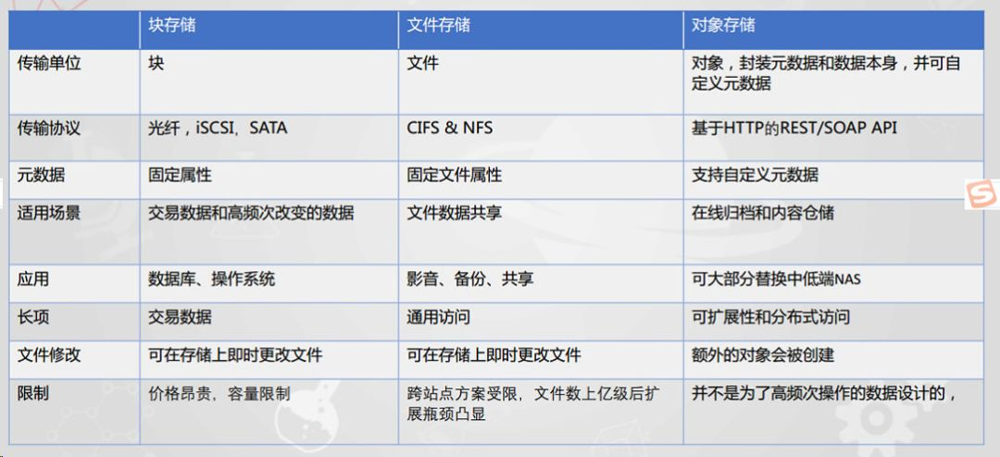

# 基础问题
1. 一台电脑有两个网口一个是以太网口一个是wifi网口都同时DHCP到同一个路由器，获取的是同一个网段的Ip，此时上网包是从哪个网口出去的？

回答：

当电脑通过两个不同的网络接口（如以太网和Wi-Fi）同时连接到同一个路由器并获得同一网段的IP地址时，实际使用哪个网络接口来发送数据包取决于操作系统的网络优先级设置。

通常，操作系统会根据以下几个因素决定通过哪个网络接口发送数据：

网络接口的优先级：大多数操作系统（包括Windows和macOS）允许用户设置网络接口的优先级。通常，以太网接口的默认优先级高于Wi-Fi接口，因为以太网连接通常更稳定、速度更快。

度量值（Metric）：如果两个网络接口具有相同的优先级，操作系统可能会使用“度量值”来决定使用哪个接口。度量值越低，优先级越高。这意味着具有较低度量值的网络接口将被优先使用。

网络状态：如果某个网络接口出现问题，如信号弱或断连，系统会自动切换到另一个网络接口。

简而言之，如果没有用户进行特定配置，大多数系统默认会选择以太网作为首选网络接口。Linux系统中，可以使用netstat -rn命令来查看。这些命令将帮助你了解各个接口的优先级和使用情况。

2. 对象存储、块存储、文件存储的区别与关系？

链接[https://www.bilibili.com/video/BV1mF4m1M7Zo/?spm_id_from=333.337.search-card.all.click&vd_source=332b21a2b9a3d1f3bba5e6131e2f2947](https://www.bilibili.com/video/BV1mF4m1M7Zo/?spm_id_from=333.337.search-card.all.click&vd_source=332b21a2b9a3d1f3bba5e6131e2f2947)

