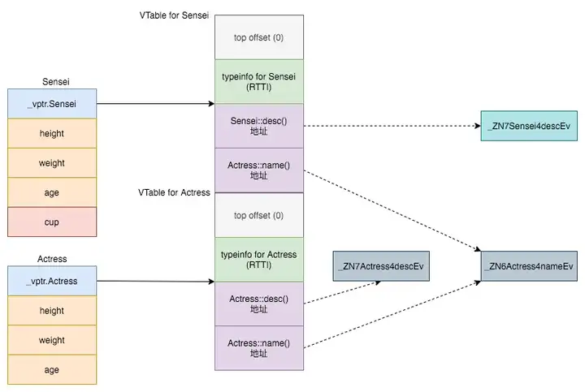
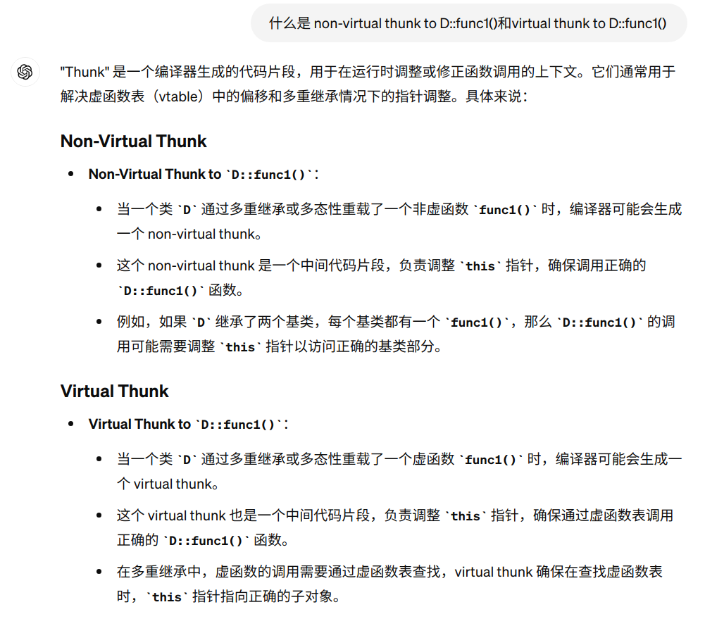
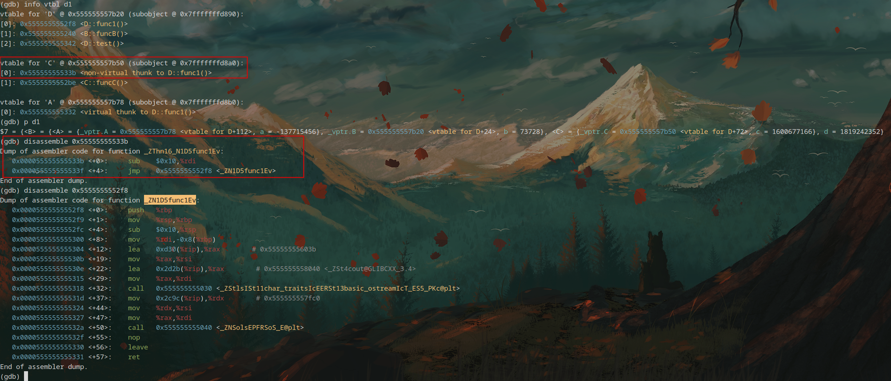

# cpp八股补充

---

## 语言特性

1. 内存序

   [https://zhuanlan.zhihu.com/p/624184204](https://zhuanlan.zhihu.com/p/624184204)

   原因:

   -  编译优化 o1, o2, o3
   -  处理器指令重排
   -  处理器缓存不一致

   ```c++
   typedef enum memory_order {
       memory_order_relaxed,
       memory_order_consume,
       memory_order_acquire,
       memory_order_release,
       memory_order_acq_rel,
       memory_order_seq_cst
   } memory_order;
   ```

   

2. 

## 经验与工具

## 

1. coredump如何调试

   `Coredump叫做核心转储，它是进程运行时在突然崩溃的那一刻的一个内存快照。操作系统在程序发生异常而异常在进程内部又没有被捕获的情况下，会把进程此刻内存、寄存器状态、运行堆栈等信息转储保存在一个文件里。`

   >1. 首先得允许操作系统生成coredump文件，`ulimit -a`可以查看coredump文件大小，如果大小为0则表示不允许生成，可以使用`ulimit -c unlimited`设置无限大，即任意情况下都会生成core文件，特别的对于arch linux，这个coredump文件不会生成在可执行文件相同目录下，似乎会生成在`var`目录下，利用`coredumpctl`统一管理；windows下需要修改注册表才行;
   >
   >2. 用gdb进行调试，arch linux提供了`coredumpctl`来支持对coredump文件的分析,实际上也用的gdb；
   >
   >3. 新版本gdb coredump之后，直接用`bt`查看调用栈即可,就是说你现在常用的gdb,就直接能看到程序是在哪个函数里面崩溃掉的;
   >
   >4. 旧一点版本的gdb（不确定g++ 4.8.1） coredump不能直接看到发生崩溃的函数，全是那个`??`，需要用一点特殊手段,得分析寄存器。
   >
   >   具体而言，则是分析`ebp`和`esp`寄存器，详细链接[https://zhuanlan.zhihu.com/p/582742454](https://zhuanlan.zhihu.com/p/582742454)
   >
   >   首先三个寄存器的地址
   >
   >   - ebp：基址指针寄存器(extended base pointer)，其内存放着一个指针，该指针永远指向系统栈最上面一个栈帧的底部
   >
   >   - esp：栈指针寄存器(extended stack pointer)，其内存放着一个指针，该指针永远指向系统栈最上面一个栈帧的栈顶
   >
   >   - eip：指令寄存器(extended instruction pointer)，其内存放着一个指针，该指针永远指向下一条等待执行的指令地址
   >
   >   对于旧版本的编译器，变量的数据区容器覆盖掉`函数返回地址`和`ebp值`，一般来讲`ebp`和`esp`指针不会差距太大,对`esp`指针指向的地址附近的值打出来，打出来的值如果有那种很类似函数地址的值，在x86下可能是0x0804****什么的，可以尝试`disassemble`反汇编代码，确定crash的函数是什么。
   >
   >   
   >
   >5. 使用`f 1`这样的命令跳转至对应的栈帧(函数)，使用`disassemble`命令可以反汇编函数代码，这时候一般会有一个箭头指向崩溃时候函数的调用位置，举例如下：在free@plt的位置崩溃掉了；
   >
   >  ```shell
   >  #1  0x080483ec in dumpCrash ()
   >  (gdb) disassemble
   >  Dump of assembler code for function dumpCrash:
   >     0x080483d4 <+0>:     push   %ebp
   >     0x080483d5 <+1>:     mov    %esp,%ebp
   >     0x080483d7 <+3>:     sub    $0x28,%esp
   >     0x080483da <+6>:     movl   $0x80484d0,-0xc(%ebp)
   >     0x080483e1 <+13>:    mov    -0xc(%ebp),%eax
   >     0x080483e4 <+16>:    mov    %eax,(%esp)
   >     0x080483e7 <+19>:    call   0x80482f0 <free@plt>
   >  => 0x080483ec <+24>:    leave
   >     0x080483ed <+25>:    ret
   >  End of assembler dump.
   >
   >  ```
   >
   >
   >
   >6. 然后使用`shell echo free@plt |C++filt`这样的方式可以看出来，去掉名词修饰效果的函数调用(或者直接肉眼猜测是free函数)
   >
   >7. 对于多线程使用`info threads`查看所有线程正在运行的指令信息,
   >
   >  打开所有线程的堆栈信息`thread apply all bt`,
   >
   >  查看指定线程堆栈信息: `thread apply threadID bt`
   >
   >  进入指定线程空间: `thread threadID`,再通过bt查看堆栈信息

   链接 [https://blog.csdn.net/jackhh1/article/details/124434307](https://blog.csdn.net/jackhh1/article/details/124434307), [https://www.bilibili.com/video/BV1zN4y1n7Uw/](https://www.bilibili.com/video/BV1zN4y1n7Uw/)

2. 段错误如何定位(考虑coredump分析)

   详细方法[https://cloud.tencent.com/developer/article/1629269](https://cloud.tencent.com/developer/article/1629269)

   - 有coredump的话 gdb + `where`命令，还有`bt`看调用栈

   - dmesg + nm

     `dmesg`可以在应用程序crash时，显示内核中保存的相关信息,通过dmesg命令可以查看发生段错误的程序名称、引起段错误发生的内存地址、指令指针地址、堆栈指针地址、错误代码、错误原因等；通过nm查看其指针信息，确定段错误位置。

3. ASan和valgrid

   - ASAN（Address Sanitizer）是针对 C/C++ 的快速内存错误检测工具，在运行时检测 C/C++ 代码中的多种内存错误
   - valgrid

4. objdump、readelf和nm命令

5. C++虚函数用在哪些场景和功能

虚函数在C++中提供了一种实现多态性、动态绑定和运行时类型识别的机制。通过将基类中的成员函数声明为虚函数，可以在派生类中重写它们，实现基于对象的多态行为，并根据对象的实际类型动态调用适当的函数。虚函数的使用能够提高代码的可扩展性和灵活性，支持面向对象编程的关键特性。

- 多态性（Polymorphism）：虚函数是实现多态性的重要机制。通过将基类中的成员函数声明为虚函数，可以在派生类中重写该函数，从而根据对象的实际类型来调用正确的函数实现。这样可以实现基于对象的多态行为，提供更灵活的代码结构和可扩展性。
- 动态绑定（Dynamic Binding）：虚函数的另一个重要功能是实现动态绑定。在运行时，通过基类指针或引用调用虚函数时，实际调用的是对象的派生类中的函数。这种动态绑定机制使得程序能够根据实际对象类型调用正确的函数，而不是仅根据指针或引用的静态类型。
- 虚析构函数（Virtual Destructor）：当一个类被继承时，如果该类有动态分配的资源（如堆内存），则通常应该为其提供一个虚析构函数。这样，当通过基类指针删除一个派生类对象时，会首先调用派生类的析构函数，然后再调用基类的析构函数。这是因为虚析构函数可以确保正确释放派生类对象中的资源，防止内存泄漏。
- 运行时类型识别（Run-time Type Identification，RTTI）：虚函数在实现RTTI时起到关键作用。RTTI是一种在运行时确定对象类型的机制。通过使用dynamic_cast操作符，可以将基类指针或引用转换为派生类指针或引用，并检查转换的结果是否为有效的指针。这使得程序可以在运行时识别对象的实际类型，并采取相应的操作。

6. cpp的静态多态性和动态动态性

- 静态多态性（编译时多态）：静态多态性是通过函数重载（function overloading）和运算符重载（operator overloading）实现的。在编译阶段，根据函数或运算符的参数类型和数量，编译器会选择调用合适的函数或运算符重载版本。这种多态性在编译时就确定了，因此称为静态多态性。
- 动态多态性（运行时多态）：动态多态性是通过虚函数（virtual function）和继承（inheritance）实现的。在运行时，根据对象的实际类型来调用适当的函数。通过基类指针或引用调用虚函数时，实际调用的是对象的派生类中的函数。这种多态性在运行时确定，因此称为动态多态性。

7. 虚函数表

这个回答可以回答相关的具体问题：
[https://www.zhihu.com/question/389546003/answer/1194780618?utm_psn=1774071592949125120](https://www.zhihu.com/question/389546003/answer/1194780618?utm_psn=1774071592949125120)

还有这个
[https://github.com/v4if/blog/issues/15](https://github.com/v4if/blog/issues/15)

重量级回答
[https://leimao.github.io/blog/CPP-Virtual-Table/](https://leimao.github.io/blog/CPP-Virtual-Table/)

### 最终极回答，可以直接看这个
[https://wenfh2020.com/2023/08/12/cpp-polymorphism-principle/](https://wenfh2020.com/2023/08/12/cpp-polymorphism-principle/)

需要注意的问题：
- 一个类有虚函数或者虚继承就有一般就会有虚函数表，尽管可能是空的
- 纯虚函数和抽象类：如果一个类包含纯虚函数（即= 0的虚函数），它被称为抽象类，不能直接实例化，但它仍然会有一个虚函数表，包含对纯虚函数的占位符指针。
- 空虚函数表：如果一个类只有纯虚函数，并且没有实现任何虚函数，虚函数表中可能只包含占位符。
- 虚函数表（vtable）并不存储在堆区（heap）或栈区（stack）中，而是存储在程序的数据段，通常是一个专门的只读数据段中。这是因为虚函数表包含的是静态数据，即每个类的虚函数表是唯一的。
- 虚函数表是连续的
- 以上建立在g++，g++中好像不存在虚基类指针的概念(vbptr)，有vbase_offset


- virtual chunk就相当于一个跳转函数，跳转到实际要运行的函数上去，比如下面把C的func1就跳转到了D的func1





总结一下，分虚继承与非虚继承

非虚继承的情况下，比较简单有以下几点
1. 子类包含父类的虚函数表，内存中先父类再子类
2. 如果子类有继承两个父类，那么子类的虚函数会放到第一个public继承的虚函数表里面（跟是否虚继承无关）
3. 存在覆盖的话一般会有thunk函数来进行函数的矫正，反汇编之后是一个addl指令和一个jump指令(thunk也分虚拟thunk和非虚拟thunk)
4. 菱形非虚继承不继承祖先基类，只有两个父类的虚函数表，剩下的和上面一样

虚继承的情况下，有以下几点
1. 类的内存分布中存在3个虚函数表，比如是

  A
 
B   C

  D

的方式继承，那么D的内存分布中存在D,C,A三个虚函数表，D是B的虚函数表+自身的虚函数补充后形成的虚函数表，相比于非虚继承，主要是有了A的虚函数表

2. 除此之外还有VTT,virtual table table,
3. 还有vbase_offset

7. 内存序

   [https://zhuanlan.zhihu.com/p/624184204](https://zhuanlan.zhihu.com/p/624184204)

   原因:

   -  编译优化 o1, o2, o3
   -  处理器指令重排
   -  处理器缓存不一致

   ```c++
   typedef enum memory_order {
       memory_order_relaxed,
       memory_order_consume,
       memory_order_acquire,
       memory_order_release,
       memory_order_acq_rel,
       memory_order_seq_cst
   } memory_order;
   ```


## Linux相关

1. 智能指针怎么实现的
2. linux下的`dmesg`和`journalctl`的区别
   - `journalctl` 是 `systemd-journald` 服务的一个前端，用于检查和查询系统日志。使用 `journalctl` 以更详细和结构化的方式查看系统日志，特别是服务单元的日志，以便更好地追踪问题。
   - 使用 `dmesg` 查看内核启动时的信息、硬件相关的消息，以及与设备驱动程序相关的问题。
3. 智能指针的应用场景
4. vector动态扩容怎么实现
5. 如何减少动态扩容时候的内存拷贝
6. 宏定义的缺点是什么，rust和c++的宏有什么区别
7. class编译出来的结构
8. 其他
9. 